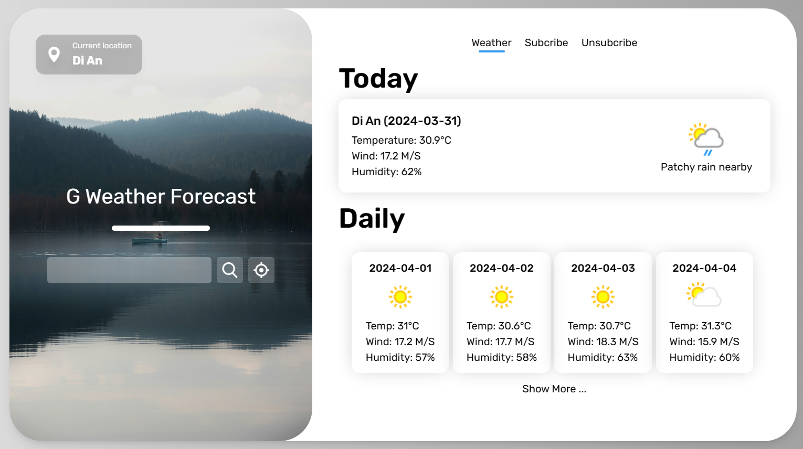

# G Weather Forcast - FE

This is a web developer intern assignment at [Golden Owl](https://goldenowl.asia/)


Link demo: https://g-weather-forecast.vercel.app/weather

\*\*\* Note: The first time it will take quite a while, please wait a moment

# How to run this project locally

- Required: Node (20.11.1), npm (10.2.4)
- Clone this repo to your device and run:
  ```bash
    npm i
  ```
- Config your `.env`

  ```env
    VITE_API_ROOT=Your API root // ignore if run in dev mode
    VITE_LOCAL_API_ROOT=Your local API root
  ```

- Run project in dev mode:
  ```bash
    npm run dev
  ```

# How to get local API root for this repo

- Visit this link to run BE: https://github.com/toanle312/g-weather-forecast-be

# Author

- [toanle312](https://github.com/toanle312)
